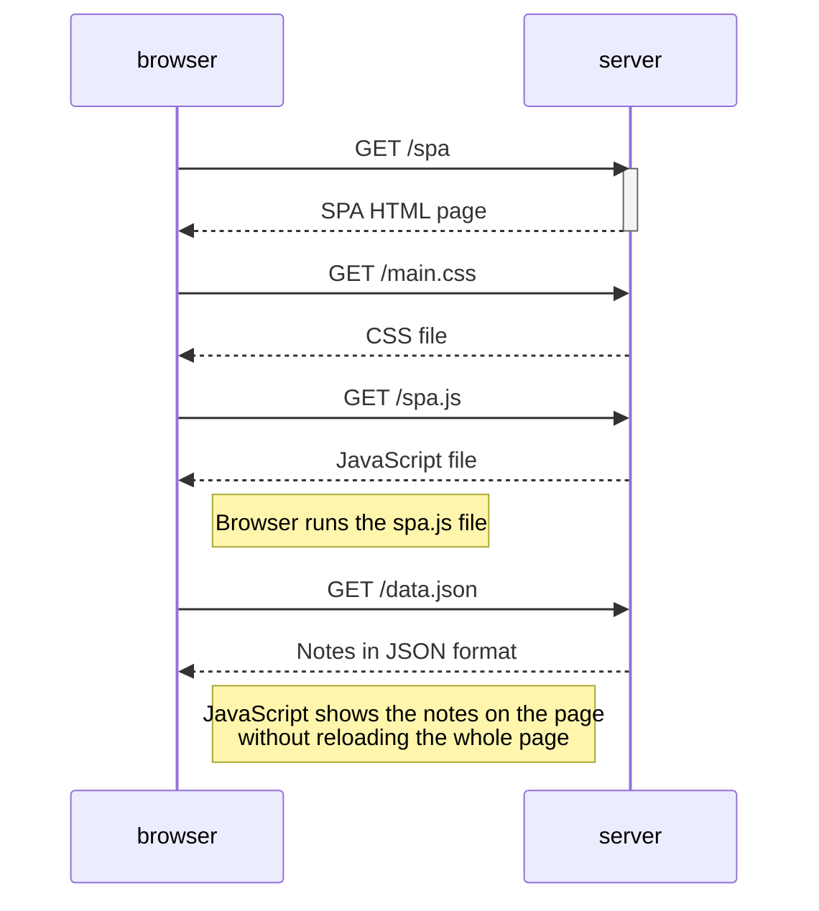

```mermaid
sequenceDiagram
    participant browser
    participant server

    browser->>server: GET /spa
    activate server
    server-->>browser: SPA HTML page
    deactivate server

    browser->>server: GET /main.css
    server-->>browser: CSS file

    browser->>server: GET /spa.js
    server-->>browser: JavaScript file

    Note right of browser: Browser runs the spa.js file

    browser->>server: GET /data.json
    server-->>browser: Notes in JSON format

    Note right of browser: JavaScript shows the notes on the page<br/>without reloading the whole page
```
