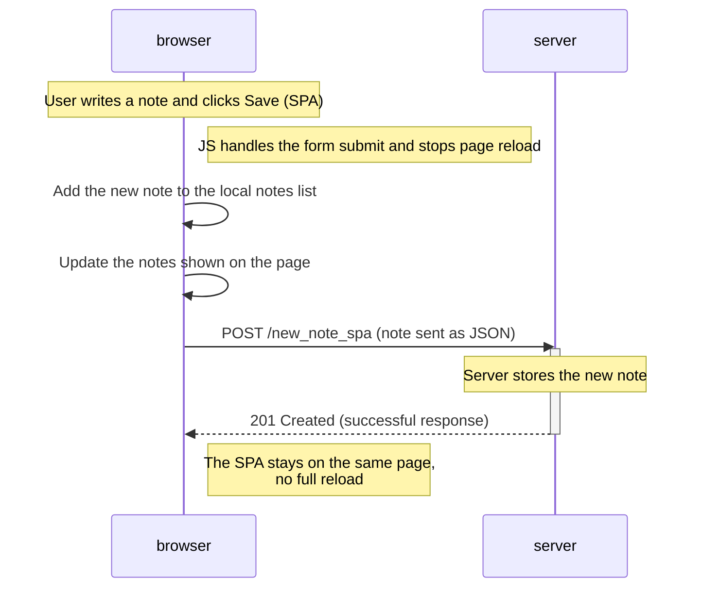

```mermaid
sequenceDiagram
    participant browser
    participant server

    Note over browser: User writes a note and clicks Save (SPA)

    Note right of browser: JS handles the form submit and stops page reload

    browser->>browser: Add the new note to the local notes list
    browser->>browser: Update the notes shown on the page

    browser->>server: POST /new_note_spa (note sent as JSON)
    activate server
    Note over server: Server stores the new note
    server-->>browser: 201 Created (successful response)
    deactivate server

    Note right of browser: The SPA stays on the same page,<br/>no full reload
```
